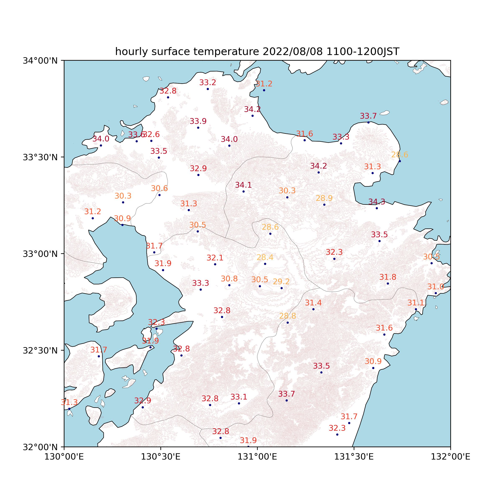
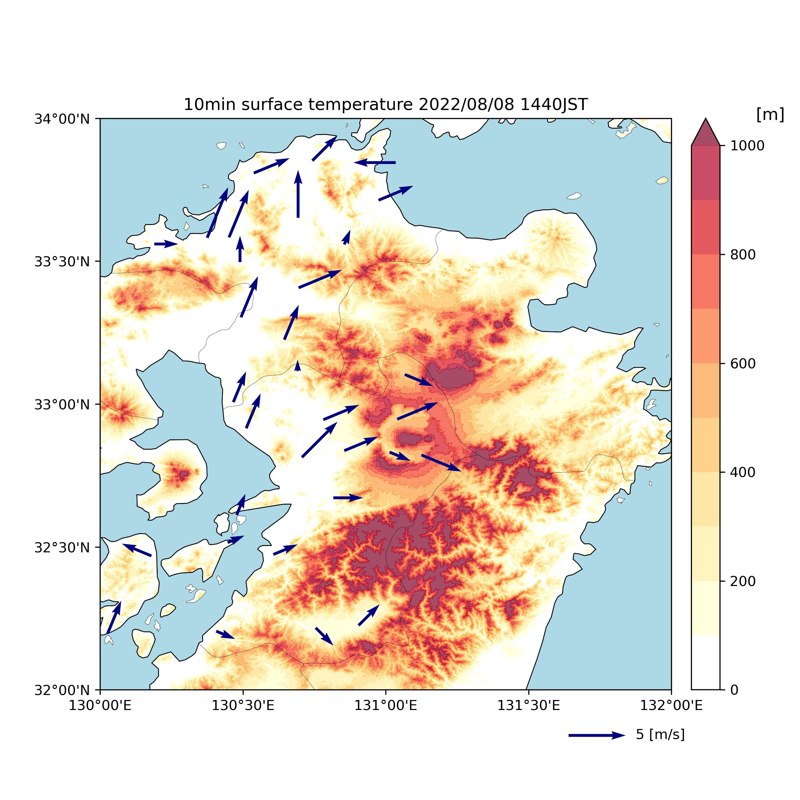

# AMeDAS Data Handling TooLs
気象庁ホームページ提供されているAMeDASデータについて、観測値のスクレイピング取得、観測値データの解析、可視化などを行えるツールです。





# 仮想環境
venv
```bash
python -m venv .venv
source .venv/bin/activate
pip install -r requirements.txt
```
conda
```bash
conda env create -f env.yml
conda activate amedas
```
# Features  
   1. AMeDAS観測地点データのスクレイピング取得  
     気象庁ホームページより、最新の観測点情報を取得し、csvファイルに保存します。取得できる情報は観測点の緯度経度、地点名、観測地点コード、観測気象要素などです。
   
   2. AMeDAS観測データのスクレイピング取得  
      気象庁ホームページより、指定した期間、指定した都道府県の観測データを取得し、csvファイルに保存します。取得できる観測値は10分間値、1時間値、日平均値です。気象庁ページからもcsvファイルをダウンロードできますが、容量制限や10分間値に非対応などの制約があるため、このツールを使用することで、効率的に観測値を取得できます。
   
   3. AMeDAS観測データの解析・可視化  
      取得した観測データを解析・可視化するための簡易的なメソッドを提供します。取得した地上風、気温、降水量などの観測データを標高付きのマップ上に簡単にプロットすることができます。これにより気象概況を容易に把握することができます。
   
# Usage
util関数は `src/tools` 以下にあります。  
仮想環境をactivateした後、参照のうえ用途に応じて、  
`src/main.py` にimportし以下のコマンドを実行してください。
```bash
python src/main.py
```
<dl>
   <dt>・ 観測地点データの取得</dt>
   <dd><code>src/tools/station_fetcher.py</code></dd>
   <dt>・ 観測値のスクレイピング取得</dt>
   <dd><code>src/tools/observation_data_fetcher.py</code></dd>
   <dt>・ 観測値の可視化</dt>
   <dd><code>src/tools/vizualization.py</code></dd>
</dl>  

＊可視化の際は`src/config/figure`以下のファイルにて、描画範囲やプロットサイズ等をカスタマイズして設定してください
作成された画像はデフォルトでは`img`下に出力されます。  
＊その他、同時刻別日のデータのコンポジット解析なども行えます。

# License
標高地図は国土地理院の提供する数値標高データより作成しています。使用する場合は出典を明記するなど、取り扱いに留意してください。(https://www.gsi.go.jp/kankyochiri/Laser_demimage.html)